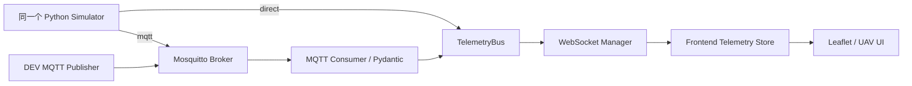
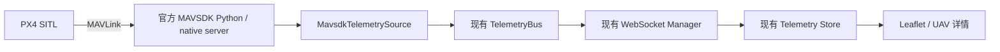

# ForestFireAI MQTT 遥测接入 V1

仅 DEV / MOCK：Python Simulator 与 MQTT Consumer 共用 TelemetryBus，再由 WebSocket 推送前端。没有真实设备、控制命令、认证、数据库或持久化。既有管理后台 API、登录与 SSE 地址保持不变。

## 架构



```text
backend/app/
  main.py                 lifespan：按模式装配与释放资源
  core/config.py          集中配置、环境变量校验
  telemetry/models.py     TelemetryMessage，唯一遥测 schema
  telemetry/bus.py        publish / subscribe / unsubscribe
  mqtt/consumer.py        接收、发布、校验、重连、有限队列
  simulator/fleet.py      五架 Mock UAV，周期任务接受 publish 回调
  simulator/motion.py     连续运动，两个模式共用
  websocket/manager.py    总线订阅者，多客户端与发送超时隔离
  api/routes.py           Health、System Status、WebSocket
backend/tools/mqtt_uav_publisher.py   DEV TOOL，复用 fleet/schema
backend/tests/                      单元和真实 Broker 集成测试
 deploy/mqtt/mosquitto.conf          仅开发环境 Broker 配置
 docker-compose.yml                 仅开发环境 Compose
```

TelemetryBus 只接受 TelemetryMessage，订阅去重、取消订阅幂等，publish 等待订阅者完成并隔离普通异常；不保留历史、不启动无上限后台任务。WebSocket Manager 订阅总线，不区分消息来源，仍并发发送并单独移除失败/超时客户端。

新增运行依赖 `paho-mqtt==2.1.0`，使用其[网络线程和自动重连接口](https://eclipse.dev/paho/files/paho.mqtt.python/html/client.html)。MQTT 网络线程校验后写入最多 256 帧的线程安全队列，异步任务再发布到 Bus；队列满丢弃最旧帧。重连从 1 秒指数退避，最多 30 秒；重连重新订阅，收到成功 SUBACK 才显示 connected。服务启动不等待 Broker 可用。

MQTT 模式的 Simulator 用同一连接发布，必须经 Broker 回流才能进入 Bus，不直接双发。QoS 0、不 retain；断线丢弃模拟帧，不补发历史。关闭时停止 Simulator，断开 MQTT 并等待线程退出，取消消费任务、清空队列、取消总线订阅、释放 WebSocket。

## 安装

Python 3.11–3.13。PowerShell，在仓库根目录：

```powershell
cd backend
python -m venv .venv
.\.venv\Scripts\Activate.ps1
python -m pip install -r requirements-dev.txt
```

仅运行可安装 requirements.txt；Linux/macOS 使用 `source .venv/bin/activate`。前端无新增依赖。本次使用 Python 3.13.11 与工作区虚拟环境中的 Paho，没有升级全局包。

## Direct 模式（默认，无需 Broker）

backend 目录、激活环境后：

```powershell
$env:TELEMETRY_INPUT_MODE = 'direct'
uvicorn app.main:app --reload
```

Simulator → Bus → WebSocket，MQTT 状态为 disabled，不建立 MQTT 连接。

## MQTT 模式与 Mosquitto

先准备 Docker / Docker Compose。在仓库根目录：

```powershell
docker compose up -d mqtt
docker compose logs -f mqtt
```

Compose 使用 eclipse-mosquitto:2.0.22，主机仅绑定 `127.0.0.1:1883`，只读挂载 [Mosquitto 配置](../deploy/mqtt/mosquitto.conf)。允许匿名、无 TLS、无持久化，**仅限开发环境，禁止作为生产配置使用**。停止用 `docker compose down`。本阶段不提供生产安全配置。

另开后端终端，进入 backend 并激活环境：

```powershell
$env:TELEMETRY_INPUT_MODE = 'mqtt'
$env:MQTT_HOST = '127.0.0.1'
$env:MQTT_PORT = '1883'
$env:MQTT_TOPIC_PREFIX = 'forestfire/uav'
uvicorn app.main:app --reload
```

五架内置 UAV 默认每秒经 Broker 发布。Broker 中断不停止 FastAPI 或 WebSocket；恢复后自动重连、重新订阅并继续遥测。

## 独立 DEV Publisher

避免两套模拟器同时发布相同 ID：在后端终端禁用内置 Simulator 再启动：

```powershell
$env:TELEMETRY_INPUT_MODE = 'mqtt'
$env:FORESTFIRE_SIMULATOR_ENABLED = 'false'
uvicorn app.main:app --reload
```

另一个激活环境的 backend 终端：

```powershell
$env:MQTT_HOST = '127.0.0.1'
$env:MQTT_PORT = '1883'
python tools/mqtt_uav_publisher.py --count 5
```

count 支持 1～5，默认五架、1 Hz；`--interval 0.5` 设置秒间隔。Ctrl+C 释放连接。工具复用现有 UavSimulator、运动模型与 TelemetryMessage。恢复内置模拟时设置 `FORESTFIRE_SIMULATOR_ENABLED=true` 并重启后端。

## 前端

仓库根目录 `.env.development.local`：

```dotenv
VITE_TELEMETRY_SOURCE=websocket
VITE_TELEMETRY_WS_URL=ws://127.0.0.1:8000/ws/telemetry
```

```powershell
pnpm dev
```

Dashboard / UAV 页面现有 DEV / MOCK SIMULATOR 显示 BACKEND WEBSOCKET 与连接状态。后端 direct/mqtt 切换无需修改前端配置；浏览器不连接 MQTT。本次未新增前端状态面板，后端/MQTT/输入模式/客户端数通过 System Status 查询。

切回本地用 `VITE_TELEMETRY_SOURCE=local` 并重启 Vite，或在现有面板选择 LOCAL SIMULATOR。切换清理旧遥测与轨迹，保留资产、Drawing 和业务图层。不要将 VITE_APP_API_URL 改为本后端；本服务没有原管理后台接口。HTTPS 页面使用 wss 地址。

## Topic、协议与状态

订阅 `forestfire/uav/+/telemetry`，发布 `forestfire/uav/{uavId}/telemetry`。Topic ID 必须逐字匹配 payload ID，否则拒绝并记录 UAV ID mismatch。前缀可配置，不接受空层级、通配符。

```json
{
  "uavId": "mock-uav-1",
  "timestamp": "2026-09-07T00:00:00.000000Z",
  "longitude": 119.52,
  "latitude": 30.13,
  "altitude": 80,
  "speed": 4,
  "heading": 0,
  "battery": 92,
  "signal": 96,
  "status": "online"
}
```

经纬度 WGS84 度，高度为相对起飞点 m，速度 m/s，航向 [0,360)，电量/信号 [0,100]。时间必须带时区，模型统一转 UTC；非法 JSON、缺字段、非法范围、非有限数、未知 status 均隔离，单帧最大 16 KiB。status 为 online/offline/mission/charging/maintenance/warning。MQTT 可省略 type，模型补齐 `type: telemetry`；`/ws/telemetry` 输出协议不变。

GET `/api/v1/health`：

```json
{ "status": "ok", "service": "ForestFireAI Backend" }
```

GET `/api/v1/system/status`：

```json
{
  "backend": "ok",
  "mqtt": "connected",
  "telemetryInputMode": "mqtt",
  "connectedWebSocketClients": 2
}
```

mqtt 为 disabled/disconnected/connecting/connected/reconnecting/error。两个诊断端点按本任务要求直接返回 JSON，不套管理后台响应壳。浏览器打开 `http://127.0.0.1:8000/api/v1/system/status` 可查看。日志包含 MQTT/WebSocket 连接变化与坏消息，不输出正常逐帧遥测、密码或完整坏 payload。

## 配置

读取进程环境变量，不自动加载 .env；修改后重启服务。原有 FORESTFIRE 配置兼容。

| 环境变量                                           | 默认                             | 含义                                |
| -------------------------------------------------- | -------------------------------- | ----------------------------------- |
| TELEMETRY_INPUT_MODE                               | direct                           | direct / mqtt                       |
| MQTT_HOST / MQTT_PORT                              | 127.0.0.1 / 1883                 | Broker 地址                         |
| MQTT_USERNAME / MQTT_PASSWORD                      | 空                               | 可选凭据，不记录日志                |
| MQTT_TOPIC_PREFIX                                  | forestfire/uav                   | 不含末尾斜线                        |
| MQTT_KEEPALIVE                                     | 10                               | 秒                                  |
| MQTT_RECONNECT_MAX                                 | 30                               | 最大退避秒数                        |
| MQTT_QUEUE_SIZE                                    | 256                              | 接收队列帧数上限                    |
| MQTT_MAX_PAYLOAD_BYTES                             | 16384                            | 单帧字节上限                        |
| MQTT_POLL_INTERVAL                                 | 0.02                             | 队列空闲检查秒间隔                  |
| FORESTFIRE_SIMULATOR_ENABLED                       | true                             | false 时仅接外部 Publisher          |
| FORESTFIRE_TELEMETRY_INTERVAL                      | 1                                | 模拟周期秒数                        |
| FORESTFIRE_SIMULATION_BOUNDS                       | 119.45–119.95° E，30.08–30.42° N | west/east/south/north JSON          |
| FORESTFIRE_BATTERY_DRAIN_RATE                      | 0.005                            | 每秒电量百分点                      |
| FORESTFIRE_OFFLINE_TIMEOUT                         | 5                                | 契约默认秒数，UI 由前端独立阈值判定 |
| FORESTFIRE_SEND_TIMEOUT / FORESTFIRE_CLOSE_TIMEOUT | 0.25 / 0.25                      | WebSocket 超时秒数                  |

## 兼容与限制

Mock ID 为 mock-uav-1/3/6/7/8，与前端资产一致。连续运动、缓慢转向、高度/信号变化、电量下降与边界反弹复用现有模型；停顿后单步最多积分两秒。Broker 断开时 Simulator 仍推进运动状态。

Telemetry Store 继续拒绝未知 ID、未来时间、重复/乱序帧，按单架最后遥测超过五秒判 offline，新帧恢复状态。Marker 复用 setLatLng，Popup/详情/轨迹同源更新，每架轨迹最多 300 点。UAVLayer/UAVTrackLayer 显隐、透明度及 Drawing 隔离不变。

仅单进程、单模拟器开发链路，不要开启多个 Uvicorn worker。没有历史重放、可靠投递、持久化、认证、真实控制或时钟校正。重启 Python 回到初始位置；前端新增资产不会自动加入后端舰队，删除后前端拒绝该 ID 遥测。

## 测试

backend 目录：

```powershell
python -m pytest -q tests
```

两个真实 Broker 测试需提供 Mosquitto 可执行文件（使用随机回环端口、临时配置，不安装服务）：

```powershell
$env:MOSQUITTO_EXECUTABLE = 'C:\path\to\mosquitto.exe'
python -m pytest -q tests
```

未提供时明确 skip，不能视为真实链路通过。覆盖 Broker 初始不可用、运行中断开恢复、Simulator/Publisher、坏包隔离和多客户端分发。

仓库根目录：

```powershell
pnpm exec node --test src/views/uav/telemetry/dataSources.test.mjs src/views/uav/simulator/simulator.test.mjs src/views/uav/uav.test.mjs src/views/dashboard/dashboard.test.mjs src/views/dashboard/components/map/gis-tools.test.mjs
pnpm exec node --test --test-concurrency=1 src/views/dashboard/components/map/testing/browser-smoke.test.mjs src/views/uav/testing/simulator-browser.test.mjs
```

真实 Python → Chromium（自动启动/重启临时本机 Uvicorn）：

```powershell
$env:FORESTFIRE_PYTHON = (Resolve-Path backend/.venv/Scripts/python.exe).Path
$env:FF_BACKEND_SMOKE = '1'
$env:TELEMETRY_INPUT_MODE = 'direct'
pnpm exec node --test src/views/uav/testing/simulator-browser.test.mjs
```

MQTT Chromium：先启动 Broker，再将 TELEMETRY_INPUT_MODE 改 mqtt，配置 MQTT_HOST/PORT，运行同一测试。确保 FORESTFIRE_SIMULATOR_ENABLED=true。GIS_BROWSER 可指定 Chromium/Chrome/Edge；缺少浏览器明确 skip。

## 常见错误

- MQTT reconnecting：检查 Docker、端口映射、MQTT_HOST/PORT；Broker 恢复后自动重连。
- invalid payload：核对 JSON、必填字段、带时区时间、范围、status。
- UAV ID mismatch：Topic 与 payload 的 ID 必须完全相同。
- WebSocket connected 但 UAV offline：连接不代表设备在线；检查 Broker、Publisher 和两端时钟。
- 后端有数据但地图没有：前端只显示已有资产 ID；任意 UAV001 不会自动创建资产。
- 轨迹交替跳动：不要同时启动内置模拟器与相同 ID 的独立 Publisher。
- status 显示 disabled：环境变量必须设置在启动 Uvicorn 的同一终端。
- Docker 命令不存在：准备 Docker Compose 后再运行容器；本次机器无 Docker，使用工作区解包的 Mosquitto 2.0.22 验证真实网络，未执行 Compose 容器启动。

## PX4 SITL + MAVSDK 只读遥测 V1

ForestFireAI 无需真机即可测试。PX4 SITL 是仿真飞控，MAVSDK 是 MAVLink 通信层；本阶段只订阅 position、velocity_ned、heading、battery 和 connection_state。没有飞行命令服务、控制按钮、参数写入或控制 HTTP API；也不调用遥测速率设置，输出频率只在本地聚合器控制。



新增 `app/mavsdk/client.py`、`mapper.py`、`telemetry_source.py`，分别负责只读 SDK 资源、字段聚合映射、连接与订阅生命周期。main 只做模式装配；Bus、WebSocket Manager 不感知 MAVSDK。mavsdk 模式不启动 Python Simulator 或 MQTT Consumer，direct/mqtt 原路径保留。

依赖固定 `mavsdk==3.17.2`，没有 DroneKit 或 pymavlink。该 SDK 通过 gRPC 连接包内的官方 mavsdk_server。此版本 System 没有公开的异步 close，因此 client 显式持有原生子进程和 gRPC channel，只实例化官方 Core、Telemetry 插件。关闭时先取消并等待订阅，再关闭 channel、终止并等待子进程；SDK 内部 gRPC 使用独立临时端口，不应对外映射。升级 SDK 时需重验此适配边界。

连接地址已经核对 [官方 MAVSDK-Python 连接说明](https://github.com/mavlink/MAVSDK-Python/blob/main/mavsdk/system.py) 及已安装 3.17.2 的 `mavsdk_server --help`：使用 `udpin://0.0.0.0:14540`。不要套用旧版示例 `udp://:14540`。

| 配置                      | 默认                  | 含义                                    |
| ------------------------- | --------------------- | --------------------------------------- |
| TELEMETRY_INPUT_MODE      | direct                | direct / mqtt / mavsdk                  |
| MAVSDK_SYSTEM_ADDRESS     | udpin://0.0.0.0:14540 | MAVLink UDP 监听地址                    |
| MAVSDK_UAV_ID             | mock-uav-1            | 对应现有前端资产 ID                     |
| MAVSDK_CONNECT_TIMEOUT    | 10                    | 秒，分别限制 SDK 通道连接与等待飞控连接 |
| MAVSDK_RECONNECT_INTERVAL | 3                     | 秒，失败后的等待间隔                    |
| MAVSDK_TELEMETRY_INTERVAL | 1                     | 秒，完整遥测最大输出频率                |
| MAVSDK_FIELD_TIMEOUT      | 5                     | 秒，每个必需流的最大数据年龄            |

### 字段与聚合语义

| 统一字段             | MAVSDK 来源 / 规则                                                          |
| -------------------- | --------------------------------------------------------------------------- |
| uavId                | MAVSDK_UAV_ID，仅身份映射，不自动创建资产                                   |
| timestamp            | position 到达后端时的 UTC 时间，不是 PX4 启动时钟或精确传感器采集时间       |
| longitude / latitude | position.longitude_deg / latitude_deg，WGS84 度                             |
| altitude             | position.relative_altitude_m，米，相对飞控 Home 高度                        |
| speed                | hypot(velocity.north_m_s, velocity.east_m_s)，水平 m/s，排除 down 分量      |
| heading              | heading.heading_deg，校验 0–360，360 归一为 0                               |
| battery              | remaining_percent；固定版本 3.17.2 文档定义为 0–100，直接校验映射，不乘 100 |
| signal               | null，未采集可靠链路信号，不填虚假百分比                                    |
| status               | 有连接且完整有效遥测时 online，不推断任务、充电或维护状态                   |

altitude **不是海拔 AMSL，也不是离地 AGL**。现有前端使用“相对起飞点高度”标签；这里按飞控 Home 解释，不保证 Home 一直等于初始起飞地面位置。不使用 absolute_altitude_m 代替缺失的 relative_altitude_m。

聚合器每个流只保留一条最新值、单调接收时间与 UTC 接收时间。四个字段流齐全且各自未过期后，按配置周期生成一条完整 TelemetryMessage；没有新 position 不重复刷新旧坐标的时间戳。任一流过期即停止输出，使前端五秒离线判定继续生效。不同流无需同频或同步到达。非法经纬度、高度、速度、航向、电量或时间记录 warning 并丢弃该帧，后续正常帧继续处理。

signal schema 从必填 number 扩展为必填 number|null，旧数字帧保持兼容，缺字段仍拒绝。部署时先更新前端，再启用 mavsdk 模式；旧前端会拒绝 null 帧。前端仅调整通用协议类型和校验，不加 MAVSDK 专属逻辑；详情/列表沿用缺失值显示。未知资产由持有资产唯一来源的前端 Store 拒绝并输出 `Telemetry rejected: UAV Asset not found` 警告，不产生 Marker 或资产。后端当前没有资产数据库，无法独立确认浏览器内的新增/删除；默认 ID 对应现有 mock-uav-1，可在详情查看实际资产 ID 后设置。

连接状态为 connecting/connected/disconnected/reconnecting/error。飞控断开、流结束或异常会清理本轮订阅和缓存，等待配置间隔再创建新连接。重新连接需重新收齐四个流，旧缓存不跨连接复用。shutdown 会取消重连等待，不遗留订阅任务。

GET `/api/v1/system/status` 在 mavsdk 模式返回：

```json
{
  "backend": "ok",
  "mqtt": "disabled",
  "telemetryInputMode": "mavsdk",
  "mavsdk": "connected",
  "mavsdkUavId": "mock-uav-1",
  "connectedWebSocketClients": 1
}
```

connected 表示飞控连接，不保证 GPS 等字段齐全；同时检查浏览器遥测更新时间。direct/mqtt 的原状态响应不变。

### 开发启动

Windows 推荐按 [PX4 官方 WSL2 指南](https://docs.px4.io/main/en/dev_setup/dev_env_windows_wsl) 准备 Ubuntu，或采用官方预构建仿真环境。本任务未安装或更改 WSL、PX4、Gazebo。为避免 WSL NAT 的 UDP 转发问题，建议 PX4 与 Python 后端运行在同一个 WSL 网络环境。

在已经准备好的 PX4 工程内，按对应 PX4 版本的 [Gazebo 仿真说明](https://docs.px4.io/main/en/sim_gazebo_gz/) 启动：

```bash
make px4_sitl gz_x500
```

保持仿真飞控静止即可观察遥测，不需要解锁或起飞。SITL 的默认地理位置可能不在当前森林 Mock 区域，收到数据后可通过 UAV 列表“定位”查看，不改地图默认视角，不伪造位置。

另开同环境的后端终端（首次先创建 venv 并安装 requirements-dev.txt）：

```bash
cd backend
source .venv/bin/activate
export TELEMETRY_INPUT_MODE=mavsdk
export MAVSDK_SYSTEM_ADDRESS=udpin://0.0.0.0:14540
export MAVSDK_UAV_ID=mock-uav-1
uvicorn app.main:app --reload
```

Windows 后端可使用 PowerShell，但应确保 SITL UDP 数据能到达 Windows 的监听端口：

```powershell
cd backend
.\.venv\Scripts\Activate.ps1
$env:TELEMETRY_INPUT_MODE = 'mavsdk'
$env:MAVSDK_SYSTEM_ADDRESS = 'udpin://0.0.0.0:14540'
$env:MAVSDK_UAV_ID = 'mock-uav-1'
uvicorn app.main:app --reload
```

前端仓库根目录 `.env.development.local` 设置 `VITE_TELEMETRY_SOURCE=websocket`、`VITE_TELEMETRY_WS_URL=ws://127.0.0.1:8000/ws/telemetry`，运行 `pnpm dev`。确认 status 中 mavsdk=connected，然后在 UAV 详情检查位置、高度、速度、航向、电量和最后更新时间；信号显示缺失属于预期。关闭 SITL 后连接状态变化且超过五秒没有新遥测时 UAV 离线，重启 SITL 后自动恢复。

### 验证与实测范围

普通 Backend tests 使用异步 SDK Mock，不要求安装或启动 PX4。包含字段映射、无效值、异频聚合、过期、不重复刷新位置、连接/超时/断开/重连/关闭、Bus→WebSocket、System Status 与只读接口检查。另测试官方 SDK 子进程和 channel 的关闭，不连接飞控。

MAVSDK Mock 适配器到真实 Chromium 的测试（仓库根目录）：

```powershell
$env:FORESTFIRE_PYTHON = (Resolve-Path backend/.venv/Scripts/python.exe).Path
$env:FF_BACKEND_SMOKE = '1'
$env:FF_MAVSDK_MOCK = '1'
pnpm exec node --test src/views/uav/testing/simulator-browser.test.mjs
Remove-Item Env:FF_MAVSDK_MOCK
```

测试入口仅位于 backend/tests，生产没有 Mock SDK 开关。该测试验证真实 source/bus/WebSocket/Store/Leaflet、null 信号、Marker 复用、轨迹、详情、离线与恢复，**不是 PX4 SITL 实测**。

若已运行可用 SITL，显式启用只读集成测试，在 backend 目录：

```powershell
$env:FORESTFIRE_SITL_TEST = '1'
$env:MAVSDK_SYSTEM_ADDRESS = 'udpin://0.0.0.0:14540'
python -m pytest -q tests/test_sitl_integration.py
```

未设置时此项明确跳过。本次本机及已有 Ubuntu-22.04 WSL 未发现 PX4 工程/可执行文件，因此没有执行 PX4→MAVLink→MAVSDK 实测，不能把 Mock 验证当作真实飞控验证。
