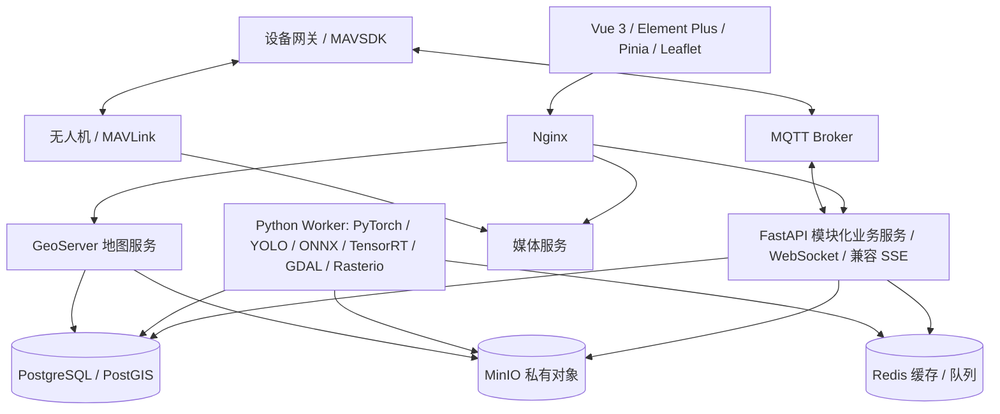

# ForestFireAI 系统架构

状态：目标架构草案 v0.1。依据 [AGENTS.md](../AGENTS.md) 与当前代码设计；新增目录、服务和协议均未实现。需求范围见 [产品需求](01-product-requirements.md)，接口及存储见 [API](04-api-design.md)、[数据库](03-database-design.md)。

## 1. 当前实现与兼容边界

| 当前证据 | 设计约束 |
| --- | --- |
| `src/main.ts`、`src/App.vue` | 沿用应用初始化、国际化、全局 UI 配置 |
| `src/router/index.ts` | 保留 Hash 路由及 Dashboard、登录、个人中心等静态入口 |
| `src/stores/permission.ts` | 新业务通过后端菜单转换注册，组件路径相对 `src/views` |
| `src/utils/request.ts`、`src/api/common.ts` | 保留 Bearer 认证、`00000` 成功码和 `{list,total}` 分页 |
| `src/layouts/components/LayoutMain.vue` | 缓存以 fullPath 包装页面，地图/视频需处理激活、停用与清理 |
| `src/stores/` | 保留既有 Store，按共享需求增加业务 Store |
| `src/composables/sse/` | 保留系统通知、字典等 SSE，新增 WS 与其并存 |
| `package.json` | 已有 Vue、TS、Vite、Element Plus、Pinia、ECharts；未有 Leaflet 或业务测试脚本 |
| `.env.development` | 默认连接上游 API，Mock 与租户关闭；未来联调先切自有环境 |

前端没有实现基于 `meta.roles` 的完整路由过滤；后端返回已授权菜单。当前只有 hasPerm 全局注册。FastAPI 接入必须覆盖登录、用户信息、菜单及保留页面的 API，不可只部署森林业务接口后让原有页面失效。

## 2. 总体部署关系

采用模块化 FastAPI 应用起步，按运行特征独立部署设备网关、媒体服务和计算 Worker，不为每个菜单建立微服务。



图中连接表示逻辑数据访问；GeoServer 读取 MinIO 影像的具体发布适配需验证，可通过 Worker 产物同步/挂载完成。MQTT Broker 与媒体服务的产品选型在接入阶段确定。

## 3. 前端组织

保留当前根目录前端，不移动到新的 frontend 目录。未来只在相关任务中增加：

```text
src/views/{gis,uav,telemetry,mission,media,fire-event,fire-alert,
           ai,remote-sensing,weather,emergency-resource,decision-support,llm-copilot}/
src/api/<同名业务域>/{index.ts,types.ts}
src/components/GisMap/          共享地图容器、图层控制、图例
src/composables/gis/            地图实例、图层、空间交互与尺寸适配
src/composables/realtime/       WebSocket 连接、订阅、恢复
src/stores/                    按实际跨页面需求增加状态
```

列表页复用 `usePageTable`、`useTableSelection` 和 `styles/page.scss`。详情页独立管理请求和局部组件。不要把 13 个模块塞入 Dashboard；Dashboard 仅聚合指标和导航。

GIS 的 map/layer 实例保存在 `shallowRef` 或非响应式对象；Store 保存视角、图层选择、当前实体 ID 和业务筛选。遥测按设备 ID 保存有限最新快照，历史轨迹通过范围查询获取。页面停用暂停绘制，卸载销毁图层、观察器与订阅；重新激活恢复大小和状态。

## 4. 后端组织与模块职责

建议将来建立 `backend/app/`，由 `api/`、`services/`、`repositories/`、`models/`、`schemas/`、`core/`、`workers/` 分层，领域代码按模块分组；迁移放 `backend/migrations/`，测试放 `backend/tests/`。此处不是创建这些目录的指令。

| 领域 | 服务责任 | 不承担的责任 |
| --- | --- | --- |
| GIS | 林区、图层目录、空间查询、发布权限 | 飞控、模型推理 |
| UAV | 设备注册、能力、命令确认与状态 | 历史遥测分析 |
| Telemetry | 协议归一、去重、最新快照、回放 | 视频转发 |
| Mission | 航线版本、任务状态与设备关联 | 绕过网关直接发 MAVLink |
| Media | 上传会话、文件元数据、访问授权 | 将视频存入数据库 |
| Fire Event | 处置状态、事件时间线、事件聚合 | 自动把所有模型结果当火灾 |
| Fire Alert | 告警规则、复核、去重、升级事件 | 应急资源实际占用 |
| AI | 模型版本、推理作业、检测及评价 | 事件人工确认 |
| Remote Sensing | 场景目录、栅格计算、产品血缘 | 把原始大栅格发往页面计算 |
| Weather | 观测/预报适配、时效和质量 | 混淆预测与实测 |
| Emergency Resource | 资源台账、可用性、预留与释放 | 自动决定调度方案 |
| Decision Support | 数据快照、规则/模型评估、方案版本 | 自动批准与执行方案 |
| LLM Copilot | 权限检索、引用、会话和建议 | 访问飞控执行工具 |

PostgreSQL 为业务事实来源；Redis 保存可重建缓存与队列；MinIO 保存影像、报告、模型产物；所有大文件通过 asset ID 关联。

## 5. 通信与可靠性

- REST：目录、查询、状态变更和人工确认，统一 `/api/v1`。
- WebSocket：浏览器遥测、告警、任务和作业进度；见 API 文档的连接票据和恢复机制。
- MQTT：网关到服务端的数据及命令传递，浏览器不直接订阅设备控制 Topic。设备凭据与租户/设备 Topic ACL 绑定。
- MAVLink/MAVSDK：网关完成飞控协议适配和实际回执映射，控制入口限定为经确认的命令记录。
- SSE：延续现有系统通知与字典同步。不得把当前全局单例直接复用成多个新服务地址。
- 视频：媒体服务提供经鉴权的 WebRTC/HLS 等播放入口，具体协议随延迟和设备能力选择；REST/WS/MQTT 不承载连续视频帧。

事件状态修改与 outbox 写入同一数据库事务，再异步投递。消费者按消息 ID 幂等。业务通知至少一次传递，客户端去重；遥测允许抽样与合并，但持久化入口保留质量标记。关键命令不得依靠队列“恰好一次”的假设。

HTTP、MQTT 或设备 ACK 只说明各自阶段的接收结果，不代表飞行动作成功。网关记录命令 ID；对不支持幂等执行的飞控，在链路不明时标记 UNKNOWN 并核对实际状态，不自动重发危险命令。

## 6. 控制与分析链路

控制请求保存设备、任务版本、参数哈希、申请人和有效期。人工确认时再次校验权限、设备状态、遥测时效和参数；原子消费确认记录并创建 outbox。网关实际发送前再次检查有效期及联锁条件。修改任务参数后原确认失效。

AI/遥感作业采用持久化 job 状态加 Worker：排队、运行、成功、失败、取消。重试生成新 attempt，结果按输入版本幂等保存。模型和输入资产保留版本，结果可追溯。GPU Worker 与 API 进程隔离，避免长任务占用 HTTP 超时窗口。

Copilot 只提供白名单只读检索和建议生成能力。检索之前按用户权限过滤文档和事件，输出引用再次校验访问权；文档里的指令被当作数据。草稿必须通过普通业务页面及授权接口才能变成任务，LLM 不获得控制确认凭据。

## 7. 部署与运行

初期 Docker Compose 按需部署 Nginx、API、数据库、Redis、MinIO、Worker；设备阶段加入网关/Broker，遥感阶段加入 GeoServer，媒体阶段加入媒体服务。无需在首阶段同时启动全部组件。

开发由 Vite 代理 `/dev-api`；生产当前前端使用 `/prod-api`，Nginx 去掉该前缀后转发 `/api/v1`。WebSocket 配置升级与长连接超时，SSE 关闭缓冲；这些是未来部署任务，不是现有配置。

健康检查区分进程存活与依赖就绪。记录 requestId、jobId、commandId、eventId；观测 API 延迟、遥测积压、命令 UNKNOWN、告警投递失败和存储容量。数据库和对象存储分别备份，并验证关联资产恢复完整。

未来需要验证的现有基础问题：权限指令更新行为、刷新响应码契约、退出后 SSE 重建、多布局内容全屏高度、类型声明与组件目录一致性。列入具体任务验证，不在文档阶段修改。
